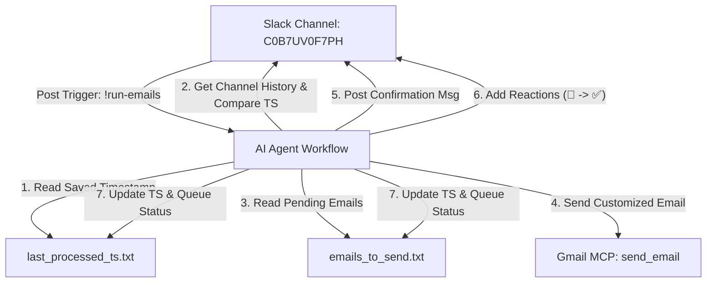

# Slide Deck: Slack-Triggered Email Orchestrator
## A Hands-On Guide to Building Autonomous Agentic Automations

---

### Slide 1: Introduction & Objective
#### What We Are Building Today
* **The Goal:** Build an autonomous AI agent that monitors a Slack channel, detects a trigger command (`!run-emails`), and processes a queue of pending emails.
* **Why this matters:** Instead of manually running scripts, we build a system where the AI acts as an independent worker—checking state, reading a queue, sending emails, and reporting back on Slack.
* **What we will use:**
  * Slack MCP (polling history, posting, reacting)
  * Gmail MCP (drafting and sending custom emails)
  * Simple files for State Management and Queuing

---

### Slide 2: System Architecture
#### How the Pieces Connect



---

### Slide 3: Concept 1 — The Queue File (`emails_to_send.txt`)
#### Why We Need a Queue
* **Concept:** A queue holds work that needs to be done. 
* **Our Structure:** A plain-text format that the AI can easily parse, read, and write:
  ```text
  ---
  Email: example@example.com
  Context: Ask for feedback on the newly set up email automation workflow.
  Status: Pending
  ---
  ```
* **Status States:** 
  * `Status: Pending` $\rightarrow$ Ready to be processed.
  * `Status: Sent` $\rightarrow$ Updated by the agent once sent, along with ID and timestamp.

---

### Slide 4: Concept 2 — State Management (`last_processed_ts.txt`)
#### Preventing Duplicate Runs
* **The Problem:** If we poll Slack every 5 minutes and see `!run-emails`, how do we know if we already processed it?
* **The Solution (State):** We save the timestamp (`ts`) of the last processed trigger message in a text file.
* **The Logic:**
  * Initialize `last_processed_ts.txt` with `0`.
  * If a trigger message has `ts > saved_ts`, process the queue.
  * Immediately overwrite `last_processed_ts.txt` with the new message's `ts`.
  * This prevents the agent from running the same trigger twice!

---

### Slide 5: The Workflow Instruction (`agent.md`)
#### The Agent's Rulebook
* **Role:** Governs the step-by-step trigger and execution pipeline.
* **Core Loop:**
  1. **Check:** Poll channel history using `slack_get_channel_history`.
  2. **Verify:** Check if there is a `!run-emails` message with a timestamp greater than the state file.
  3. **Acknowledge:** Add 👀 reaction to the trigger message.
  4. **Execute:** Run the email queue skill.
  5. **Complete:** Update state file and add ✅ reaction to the trigger message.

---

### Slide 6: The Skill Definition (`draft_email_skill.md`)
#### Teaching the AI How to Write Emails
* **Rule 1: Direct Translation** $\rightarrow$ No generic templates! Translate the raw context semantic meaning into professional business English.
  * *Example:* If context is *"gokul you given task can't to be finishable"*, the email body politely addresses the task feasibility.
* **Execution Steps for the Skill:**
  1. Read `emails_to_send.txt`.
  2. Find all blocks with `Status: Pending`.
  3. Send email using `send_email`.
  4. Post Slack confirmation: `Message has been sent by Agent. Recipient: <email> | Subject: <subject>`
  5. Mark status as `Sent` in the queue file.

---

### Slide 7: Steps to Build (Hands-On Phase)
#### Let's Set Up the Files
1. **Initialize Files:**
   * Create `emails_to_send.txt` with a mock pending email.
   * Create `last_processed_ts.txt` initialized to `0`.
2. **Define Agent Workflow:**
   * Create `agent.md` with the trigger checks and reaction rules.
3. **Define Skill Rules:**
   * Create `draft_email_skill.md` containing the custom email copy guidelines.

---

### Slide 8: Verification & Scheduling
#### Putting It on Autopilot
* **Manual Run:**
  * Post `!run-emails` in the Slack channel.
  * Instruct the agent to run `agent.md` manually.
  * Watch the reactions change (👀 $\rightarrow$ ✅), email get sent, and files update.
* **Automation Run:**
  * Use the `/schedule` command or a cron task to run `agent.md` every 5 minutes.
  * Now, the system is fully automated and runs completely unattended!
